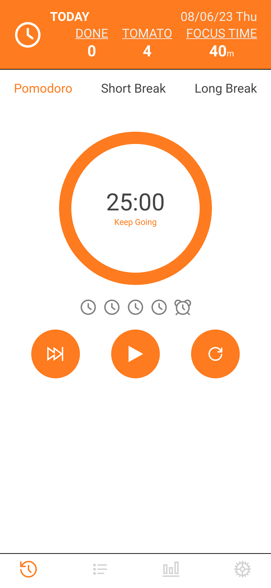
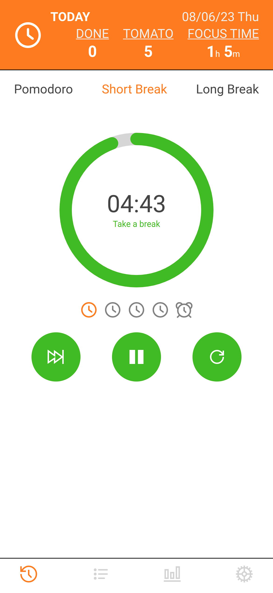
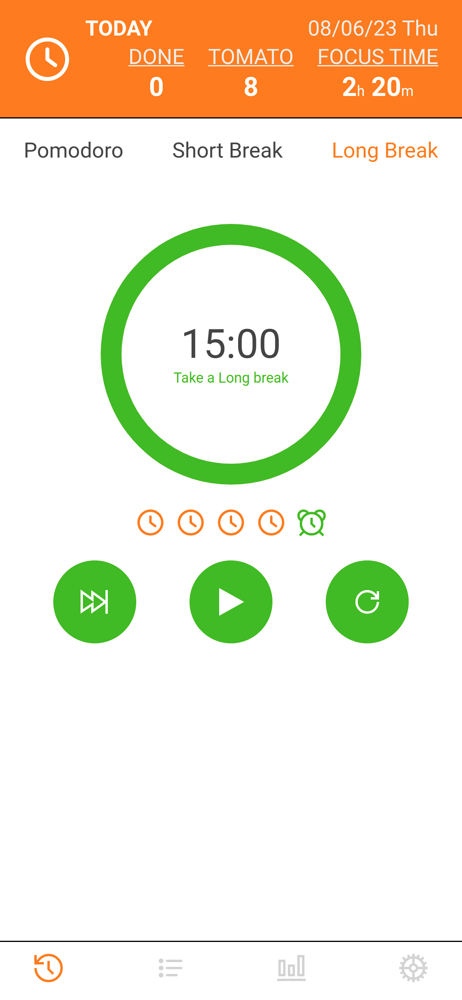
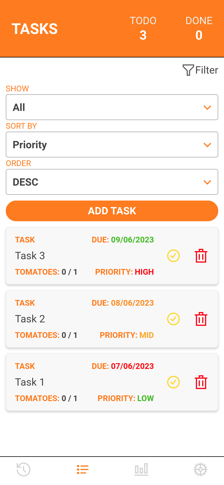
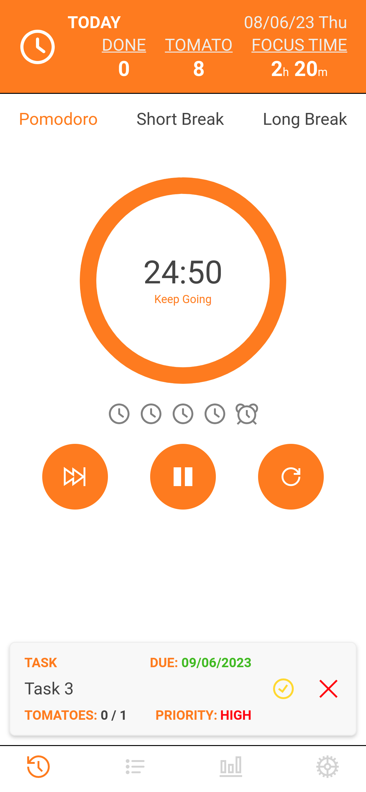
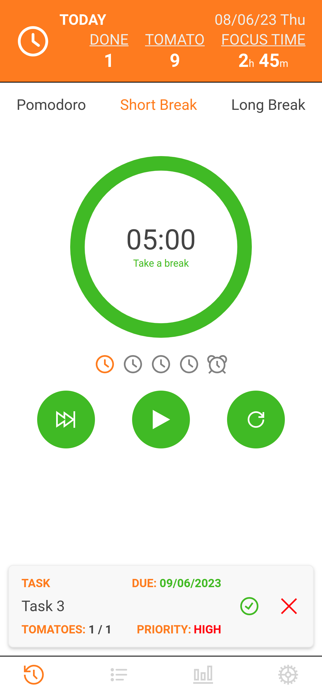
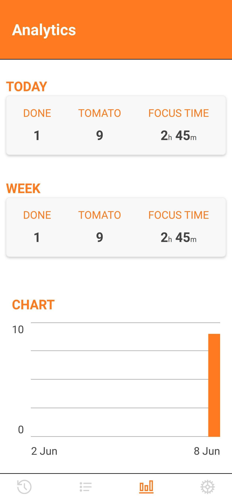
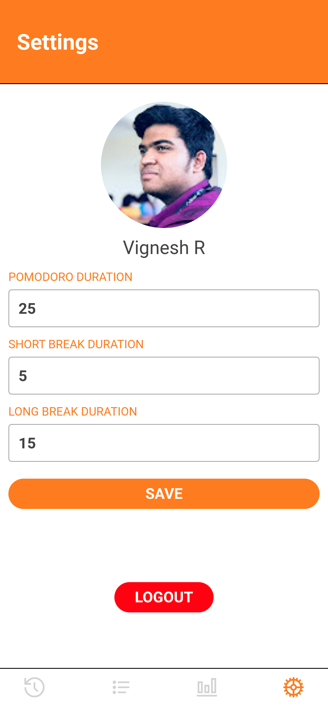

## Getting Started

First, run the development server:

```bash
npm run dev
# or
yarn dev
# or
pnpm dev
```
----

## Live Demo
[https://lief-pomodoro.vercel.app/](https://lief-pomodoro.vercel.app/)

---


## Screen Shots
---









## Features Implemented
---
- Task Management
- Pomodoro Timer
- User Authentication (Auth0)
- Grommet UI/UX
- Analytics Dashboard
---

## Folder Structure
```
.
├── graphql/
│   └── resolvers.ts <== Graphql resolvers
├── lib/
│   ├── apollo.ts <== Graphql Client Configuration
│   └── prisma.ts <== Prisma Singleton
├── prisma/
│   └── schema.prisma <== All schemas
└── src/
    ├── pages/
    │   └── api/
    │       ├── auth <== auth0 endpoint
    │       └── graphql <== Graphql endpoint
    ├── components/ <== All Components
    └── context/ <== All Contexts
```
---
## ER Diagram


---
## Tech Stack


---